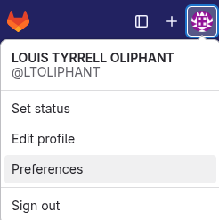
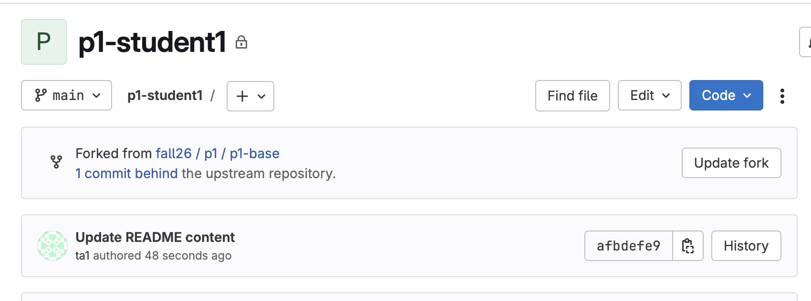

# 🧭 CS 537 Project Workflow

Welcome to your personal repository for a CS 537 project! This repository is a *
*fork** of the official base repository for the project (e.g., `p1-base`) and is
your private workspace for development and submission. Work committed to the
`main` branch will be pulled for grading. Tests on your solution will be run in
the [CS537-Docker container](https://git.doit.wisc.edu/cdis/cs/courses/cs537/useful-resources/cs537-docker)
therefore it is recommended that you clone this repository inside the
container's `cs537-projects/` directory. This will allow you to have access to
the contents of this repository from your host computer for development and from
inside the docker container for testing. Follow those instructions to setup the
container before cloning this repository.

Whether you're working individually or in a team, this guide explains how to
stay in sync and structure your workflow correctly.

---

## 🔑 Setting Up GitLab Token

To interact smoothly with DoIT's GitLab, you'll need a Personal Access Token (
PAT). You can read about DoIT authentication
in [the knowledgebase](https://kb.wisc.edu/shared-tools/page.php?id=117615). You
can follow these instructions for storing your PAT in a plain-text file. If you
would like a more secure way to store PATs, you may want to
setup [Git's credential manager](https://git-scm.com/book/en/v2/Git-Tools-Credential-Storage).

You want to generate a personal access token for your user account. First, click
on the icon for your account near the top left (not the fox, the strange circle
icon ) to bring up your user menu.

1. **Create a PAT** on GitLab:

- Go to **Preferences -> Access Tokens**.
- Generate a token with at least `read_repository` and `write_repository`
  permissions.

2. **Store the PAT securely**:

- Create a hidden file in your home directory (recommended):

   ```bash
   echo "<your-token>" > ~/.gl_cs537
   chmod 600 ~/.gl_cs537
   ```

- Or you can run the following commands which does the above automatically:

   ```bash
   echo "Enter your GitLab token: "; read -s GITLAB_TOKEN; echo "$GITLAB_TOKEN" > ~/.gl_cs537; chmod 600 ~/.gl_cs537
   ```

3. **Cloning with PAT**:

- You can directly clone your forked repository using your NetID and token via
  HTTP. For example:

   ```bash
   git clone https://<your-netid>:<your-token>@<repository-url>
   ```

- Alternatively, run this to manually enter your credentials (assumes you have
  stored your token in `~/.gl_cs537`):

   ```bash
   echo "Enter your NetID: "; read NETID; echo "Enter the repository URL (e.g. https://gitlab.com/namespace/project.git): "; read REPO_URL; STRIPPED_URL=${REPO_URL#https://}; TOKEN=$(< ~/.gl_cs537); git clone "https://${NETID}:${TOKEN}@${STRIPPED_URL}"
   ```

---

## 🔄 Keeping Your Fork Up to Date

This repository is a fork, so it's your responsibility to **pull updates** (
e.g., new test cases or spec changes) from the base repository.

### 🛠️ Sync Using Git GUI:

You can click the "Update Fork" button whenever there is an update in the base
repository.


### 🔧 Handling Merge Conflicts (Git CLI):

Sometimes, there might be merge conflicts that Git GUI cannot handle. Use Git
CLI to manually sync:

```bash
# Fetch the latest changes
git fetch upstream

# Merge into your fork
git merge upstream/main

# Resolve conflicts, then stage the changes:
git add <conflicted-files>

# Commit the resolved merge
git commit

# Push updates to your fork
git push
```

> 🚨 **Tip**: Always run `git pull` / `git fetch` before starting new
> development.

---

## 💡 Development Tips (Optional)

> These are just suggestions—feel free to follow your preferred workflow.

### Individual Repositories

If you're working alone, you can push commits directly to the `main` branch:

```bash
# Stage and commit your changes
git add .
git commit -m "Implemented part A"

# Push to main
git push origin main
```

### Team Repositories

When collaborating, it's often helpful to isolate features on branches:

```bash
# Create a personal feature branch
git checkout -b <your-netid>-feature

# Work on your changes, then stage and commit
git add .
git commit -m "Work on feature X"

# Push your branch and open a merge request
git push -u origin <your-netid>-feature
```

> You can then open a merge request into `main` for team review.

---

## 🔔 Reminders

- Keep your fork synced regularly.
- Monitor announcements for important updates.
- Make sure you commit and push your code before the due date. The `main` branch
  will be used by the grading script.
