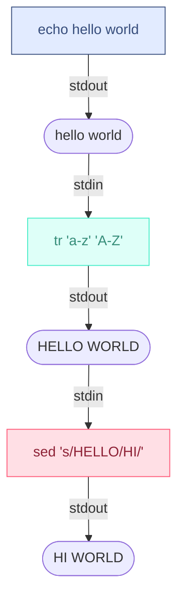

# Supporting pipelines

A pipeline is a sequence of one or more (sub)-commands separated by the control
operators `|`.

For example, in the command below, the output of `ls -l` is passed as input to
`grep .c`, and the output of `grep .c` is passed as input to `wc -l`. This
lets you count the number of `.c` files in the current directory.

```shell
ls -l | grep .c | wc -l
```

The output of each command in the pipeline is connected via a pipe to the
input of the next command. That is, each command reads (`stdin`) the previous
command's output (`stdout`).

Your shell should be able to handle 128 pipelines in a single command line.

Let us look at how a pipeline works. Consider this simple command:

```shell
echo hello world | tr 'a-z' 'A-Z' | sed 's/HELLO/HI/'
```

1. The first sub-command `echo hello world` writes `hello world` to its standard
   output (`stdout`). Your shell should create a pipe and redirect the
   `stdout` of this command to the write end of the pipe.
2. The second sub-command `tr 'a-z' 'A-Z'` reads from its standard input
   (`stdin`), which should be connected to the read end of the pipe created.
3. The output of the second command is again written to its `stdout`. Your shell
   should create another pipe and redirect the `stdout` of this command to the
   write end of the new pipe.
4. The third sub-command `sed 's/HELLO/HI/'` reads from its `stdin`, which
   should be connected to the read end of the second pipe. The output of this
   command is written to the terminal (the original `stdout` of your shell).

> [!important]
>
> All the sub-commands in the pipeline should be executed **concurrently**.
> That is, your shell should not wait for the first command to finish before
> starting the second command. All commands should be started as soon as
> possible.
>
> Each sub-command in the pipeline should be executed in a separate child
> process created using `fork()`. Your shell should create the necessary
> pipes and set up the `stdin` and `stdout` of each command using `dup2()`.
>
> Remember to close all unused file descriptors in the parent and child
> processes to avoid resource leaks and deadlocks.



## Handling Errors

- If any of the segments of the pipe is/are empty, your shell should print
  `Empty commmand segment in pipeline\n` to `stderr`, and not execute the
  pipeline.
- If any of the commands in the segments of the pipe are not found (not a
  builtin or executable), your shell should print the error message 'Command
  not found or not an executable: %s\n' for each command not found, where `%s`
  is the command. Do not execute the pipeline in this case.

## Some things to try out

- If everything is working correctly, you should be able to do some pretty
  fun stuff now. Try out some of these commands in your shell:
  - `ls -l | grep .c | wc -l` - Count the number of `.c` files in the current
    directory.
  - `cat /etc/passwd | grep /bin/bash | cut -d: -f1` - List all users
    with `/bin/bash` as their default shell.
  - `ps aux | grep wsh | awk '{print $2}' | xargs kill -9` - Kill all
    instances of your shell.
  - `find . -name '*.c' | xargs grep 'main'` - Find all `.c` files
    containing the word `main`.
  - `echo 'Hello World' | rev | tr 'A-Z' 'a-z' | awk '{print $2, $1}'` - Reverse
    the string, convert to lowercase, and swap the words.
  - `seq 1 10 | awk '{sum += $1} END {print sum}'` - Calculate the sum of
    numbers from 1 to 10.
- Try out combining them with built-in commands like `alias` and `path`. For
  example:
  - `alias | grep e` - You can use this to search for aliases you have set.
  - `path | tr 'a-z' 'A-Z'` - This will print the current PATH in uppercase.
  - `wc -L file1.txt file2.txt file3.txt | sort -n` - This will count the
    longest line in each file and sort the output.
- Experiment with different commands and see how they can be combined using pipe.