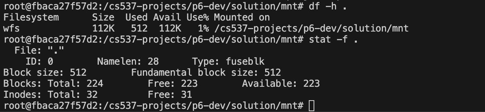

# Part 2 – Show me the Big Picture (statfs)
---

## Objective
---

Your goal is to report aggregate filesystem statistics. This is the function that answers the user's question, "How much space is free on this disk?" It's the powerhouse behind command-line tools like `df -h (disk free)` and `stat -f`.

## Key Concepts
---

Your filesystem is the "manager" of the disk. Like any manager, it needs to be able to "take inventory." This involves answering two questions:

1. What is my total capacity? This information is static. When the filesystem was first created by mkfs, it was told the total number of inodes and data blocks it would manage. This "capacity" is recorded permanently in the superblock.

2. What is my current usage? This information is dynamic and changes every time a file is created, written to, or deleted. To find the current usage, you must consult your live ledgers: the inode bitmap and the data bitmap. The number of free blocks is simply the number of 0s in the data bitmap.

## Implementation Guidance
---

Your task is to implement the `wfs_statfs` function in `wfs.c`. This function corresponds to the `.statfs = wfs_statfs` callback in the `wfs_ops` struct.

This function must fill in the `struct statvfs` passed to it by FUSE, using the concepts of "Capacity" (from the superblock) and "Usage" (from the bitmaps) to report the correct statistics.

Example attributes to be filled in statvfs:
- `f_blocks` = total data block capacity.
- `f_files` = total inode capacity.
- `f_bfree`/`f_bavail` = number of free data blocks.

Creating files reduces `f_ffree`; writing allocating blocks reduces `f_bfree`.

## Sanity Check
---

You should be able to call `stat -f` and `df -h` on your mountpoint to get accurate filesystem statistics as below:

